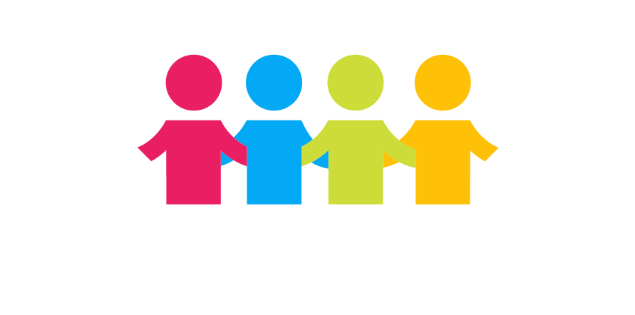

  

  

    Projeto social desenvolvido durante o Hackathon <a href="http://comunicode.com.br/">ComuniCode</a> da Monitoratec<a href="http://monitoratec.com.br/">Monitoratec</a> nos dias 9 e 10 de Junho de 2018, São Carlos - Brazil.
     
  

 
 

## http://galhardo-comunicode.netlify.com/
